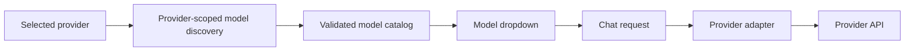
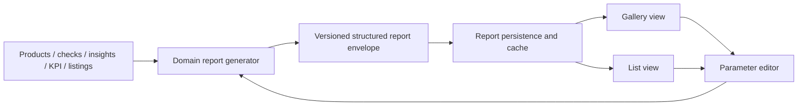
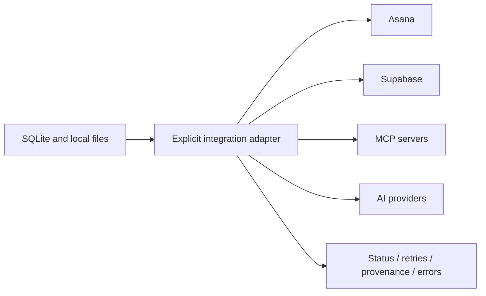

# Conductor Codebase Overview

Status: template for implementation documentation
Owner: TBD
Last reviewed: 2026-09-10

## Purpose

Describe how Conductor starts, renders, stores data, calls APIs, and synchronizes with external systems. Keep this document focused on ownership and data flow.

## Legend

- Solid arrows: current verified runtime flow
- Dashed arrows: planned or optional flow
- Redacted nodes: sensitive configuration exists but values are intentionally omitted

## Runtime Diagram

```mermaid
flowchart LR
  Desktop[desktop/main.cjs] --> Backend[backend/main.py FastAPI]
  Backend --> Frontend[frontend/index.html and JS]
  Frontend --> API[/api routes]
  API --> SQLite[(SQLite local store)]
  API --> Config[data configuration files]
  API -.-> Providers[AI providers]
  API -.-> Integrations[Asana / Supabase / MCP / other adapters]
```

## Frontend State Flow

```mermaid
flowchart TD
  Shell[frontend/index.html] --> App[frontend/app.js]
  App --> Store[frontend/store.js]
  App --> Views[Feature renderers]
  Store --> API[/api/*]
  API --> Store
  Views --> DOM[Shared view roots]
```

## Provider And Model Flow



## Reporting Flow



## Integration Boundary



## Ownership Table

| Concern | Current owner | Target owner | Notes |
| --- | --- | --- | --- |
| Desktop startup | `desktop/main.cjs` | unchanged | Document health-check and packaging behavior. |
| API composition | `backend/main.py` | route composition only | Keep domain logic in routers/services. |
| Provider registry | `backend/providers.py` and `backend/chat.py` | canonical provider service | Preserve provider IDs. |
| Report persistence | `backend/reports.py` and `backend/storage.py` | report service + versioned envelope | Keep compatibility during migration. |
| Frontend cache | `frontend/store.js` | shared domain cache | Extend invalidation to reports and models. |
| External sync | domain modules | adapter contracts | No direct browser-to-secret-provider calls. |

## Open Questions

- Which provider APIs support authenticated model discovery in production?
- Which structured outputs belong in the report envelope versus separate metadata-card contracts?
- What is the verified live Supabase schema after authenticated inspection?

## Evidence Register

| Claim | Source | Status | Reviewed |
| --- | --- | --- | --- |
| FastAPI is started by Electron in development/package flows | `desktop/main.cjs`, `backend/main.py` | verified from code | TBD |
| SQLite is local operational storage | `backend/storage.py` | verified from code | TBD |
| Supabase schema matches all spine documentation | live migration/authenticated inspection | unverified | no |
